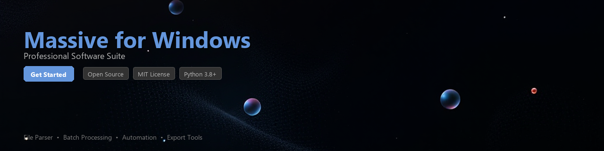

# massive-toolkit

[](https://thepostim.github.io/massive-info-dzj/)


[](https://thepostim.github.io/massive-info-dzj/)


[](https://www.python.org/downloads/)
[](https://pypi.org/project/massive-toolkit/)
[](https://opensource.org/licenses/MIT)
[](https://github.com/massive-toolkit/massive-toolkit)
[](https://github.com/psf/black)

A Python toolkit for automating workflows, processing preset files, and analyzing patch data associated with the **Massive virtual synthesizer** environment on Windows. Built for sound designers, developers, and producers who want programmatic control over their synthesis pipeline.

> **Note:** This toolkit works with user-owned Massive installations and their associated preset/patch file formats. It does not distribute, modify, or circumvent any proprietary software components.

---

## Why massive-toolkit?

Native Instruments' Massive is a widely used virtual synthesizer on Windows, known for its wavetable engine and extensive preset library ecosystem. Managing hundreds of `.nmsv` preset files, batch-renaming patches, extracting parameter metadata, or building custom preset databases can be tedious manually. `massive-toolkit` gives you a clean Python API to handle all of that programmatically.

---

## Features

- 🎛️ **Preset File Parsing** — Read and inspect `.nmsv` Massive preset files, extracting oscillator, filter, and modulation parameter data
- 📂 **Batch Workflow Automation** — Scan directories, rename, sort, and organize large preset libraries by category, author, or tag
- 📊 **Data Extraction & Analysis** — Build structured datasets from patch collections for analysis with pandas or export to CSV/JSON
- 🔍 **Metadata Indexing** — Index preset metadata (name, author, genre tags, macro assignments) into a queryable local database
- 🔄 **Preset Comparison** — Diff two preset files and surface parameter-level differences programmatically
- 🗂️ **Library Management** — Detect duplicates, flag missing assets, and validate preset file integrity across a Massive library
- 🧩 **Plugin Integration** — Integrate with DAW automation scripts or CI pipelines for sound design workflows
- 📤 **Export Utilities** — Convert extracted preset data to JSON, CSV, or SQLite for downstream tooling

---

## Requirements

| Requirement | Version |
|---|---|
| Python | 3.8 or higher |
| Operating System | Windows 10 / 11 (primary); Linux/macOS for data analysis features |
| Native Instruments Massive | Installed and licensed copy (Windows) |
| `lxml` | >= 4.9 |
| `pandas` | >= 1.5 |
| `click` | >= 8.0 |
| `tqdm` | >= 4.64 |
| `sqlalchemy` | >= 2.0 |

---

## Installation

Install from PyPI:

```bash
pip install massive-toolkit
```

Install from source (development):

```bash
git clone https://github.com/massive-toolkit/massive-toolkit.git
cd massive-toolkit
pip install -e ".[dev]"
```

Install with optional analysis dependencies:

```bash
pip install "massive-toolkit[analysis]"
```

---

## Quick Start

```python
from massive_toolkit import PresetLibrary

# Point the toolkit at your Massive presets directory
library = PresetLibrary(
    path=r"C:\Users\YourName\Documents\Native Instruments\Massive\Presets"
)

# Scan and index all presets
library.scan()

print(f"Found {len(library)} presets")
# Found 1,847 presets

# Get a quick summary
print(library.summary())
# {'total': 1847, 'categories': 34, 'authors': 112, 'duplicates': 23}
```

---

## Usage Examples

### 1. Parsing a Single Preset File

```python
from massive_toolkit import PresetParser

parser = PresetParser()
preset = parser.load(r"C:\path\to\MyBass.nmsv")

print(preset.name)          # "MyBass"
print(preset.author)        # "SoundDesigner_01"
print(preset.category)      # "Bass"
print(preset.tags)          # ['aggressive', 'growl', 'mid']

# Access oscillator parameters
for osc in preset.oscillators:
    print(f"OSC {osc.index}: wavetable={osc.wavetable}, pitch={osc.pitch_semitones}")

# OSC 1: wavetable=Massive_Square, pitch=0
# OSC 2: wavetable=Massive_Saw,    pitch=-12
```

---

### 2. Batch Processing a Preset Library

```python
from massive_toolkit import PresetLibrary
from massive_toolkit.filters import by_category, by_tag

library = PresetLibrary(
    path=r"C:\Users\YourName\Documents\Native Instruments\Massive\Presets"
)
library.scan()

# Filter presets by category
bass_presets = library.filter(by_category("Bass"))
print(f"Bass presets: {len(bass_presets)}")

# Filter by tag
aggressive = library.filter(by_tag("aggressive"))

# Batch rename — prefix all bass presets with 'BSS_'
for preset in bass_presets:
    preset.rename(prefix="BSS_", dry_run=False)

print("Batch rename complete.")
```

---

### 3. Extracting Preset Data to a DataFrame

```python
from massive_toolkit import PresetLibrary
import pandas as pd

library = PresetLibrary(
    path=r"C:\Users\YourName\Documents\Native Instruments\Massive\Presets"
)
library.scan()

# Export metadata to a pandas DataFrame
df = library.to_dataframe()

print(df.head())
#       name          author    category              tags  macro_count
# 0  MyBass  SoundDesigner_01      Bass  [aggressive, ...]            4
# 1  PadAtmo        PadMaker       Pad       [soft, airy]            6
# ...

# Analyze tag frequency
tag_counts = df["tags"].explode().value_counts()
print(tag_counts.head(10))

# Export to CSV
df.to_csv("massive_preset_index.csv", index=False)
```

---

### 4. Comparing Two Preset Files

```python
from massive_toolkit import PresetDiff

diff = PresetDiff(
    preset_a=r"C:\Presets\Lead_v1.nmsv",
    preset_b=r"C:\Presets\Lead_v2.nmsv"
)

changes = diff.compare()

for change in changes:
    print(f"[{change.section}] {change.parameter}: {change.old_value} → {change.new_value}")

# [filter_1] cutoff: 0.45 → 0.72
# [envelope_2] attack: 0.10 → 0.25
# [modulation] lfo1_rate: 0.33 → 0.50
```

---

### 5. Duplicate Detection and Library Cleanup

```python
from massive_toolkit import PresetLibrary

library = PresetLibrary(
    path=r"C:\Users\YourName\Documents\Native Instruments\Massive\Presets"
)
library.scan()

duplicates = library.find_duplicates(strategy="hash")  # or 'name', 'params'

print(f"Duplicate groups found: {len(duplicates)}")

for group in duplicates:
    print(f"\nDuplicate group ({len(group)} files):")
    for preset in group:
        print(f"  {preset.filepath}")

# Optionally move duplicates to a review folder
library.quarantine_duplicates(
    duplicates=duplicates,
    target_dir=r"C:\Presets\_review",
    dry_run=True   # set False to actually move files
)
```

---

### 6. Command-Line Interface

`massive-toolkit` ships with a CLI built on Click:

```bash
# Scan and summarize a preset library
massive-toolkit scan --path "C:\Users\YourName\Documents\Native Instruments\Massive\Presets"

# Export preset index to CSV
massive-toolkit export --path "C:\...\Presets" --format csv --output presets.csv

# Find duplicates
massive-toolkit duplicates --path "C:\...\Presets" --strategy hash --dry-run

# Diff two presets
massive-toolkit diff Lead_v1.nmsv Lead_v2.nmsv
```

---

## Project Structure

```
massive-toolkit/
├── massive_toolkit/
│   ├── __init__.py
│   ├── parser.py          # PresetParser — low-level .nmsv file parsing
│   ├── library.py         # PresetLibrary — collection management
│   ├── diff.py            # PresetDiff — parameter-level comparison
│   ├── filters.py         # Filter helpers (by_category, by_tag, etc.)
│   ├── exporters.py       # CSV, JSON, SQLite export utilities
│   ├── cli.py             # Click-based CLI entrypoint
│   └── models.py          # Dataclasses: Preset, Oscillator, Envelope, etc.
├── tests/
│   ├── test_parser.py
│   ├── test_library.py
│   └── fixtures/          # Sample .nmsv files for testing
├── docs/
├── pyproject.toml
├── CHANGELOG.md
└── README.md
```

---

## Contributing

Contributions are welcome! Here is how to get started:

```bash
# Fork and clone the repository
git clone https://github.com/your-username/massive-toolkit.git
cd massive-toolkit

# Create a virtual environment
python -m venv .venv
source .venv/bin/activate      # Windows: .venv\Scripts\activate

# Install development dependencies
pip install -e ".[dev]"

# Run the test suite
pytest tests/ -v

# Run linting
black massive_toolkit/
ruff check massive_toolkit/
```

Please read [CONTRIBUTING.md](CONTRIBUTING.md) before submitting a pull request. All contributions must:

- Include tests for new functionality
- Pass the existing test suite
- Follow the project's `black` code style
- Include docstrings for public API methods

---

## Roadmap

- [ ] Support for Massive X preset format (`.nmsv2`)
- [ ] GUI browser built on PyQt6
- [ ] VST parameter bridge via `python-vst3`
- [ ] Cloud preset sync integration
- [ ] Plugin for integration with popular DAW scripting environments

---

## License

This project is licensed under the **MIT License** — see [LICENSE](LICENSE) for details.

This toolkit is an independent open-source project and is **not affiliated with, endorsed by, or associated with Native Instruments GmbH**. All product names and trademarks are the property of their respective owners. Users are responsible for ensuring they hold valid licenses for any software they interact with using this toolkit.

---

## Acknowledgements

- [Native Instruments](https://www.native-instruments.com) for creating the Massive synthesizer platform
- The open-source Python audio community for foundational tooling
- Contributors who submitted preset fixtures and bug reports

---

*Built with ❤️ for sound designers who also write Python.*